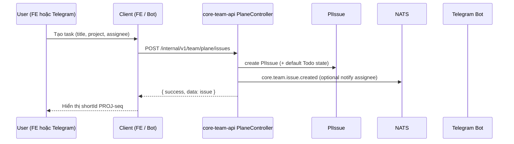
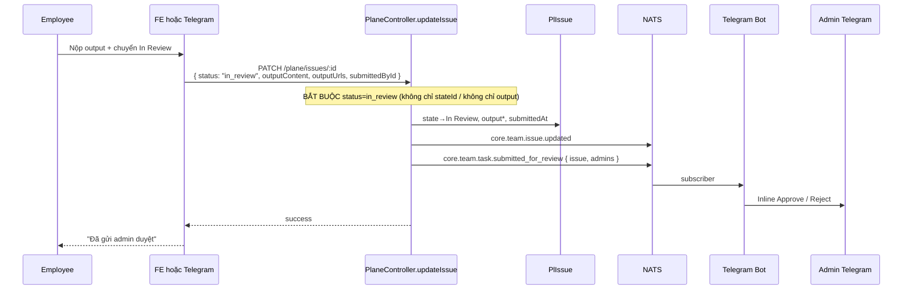
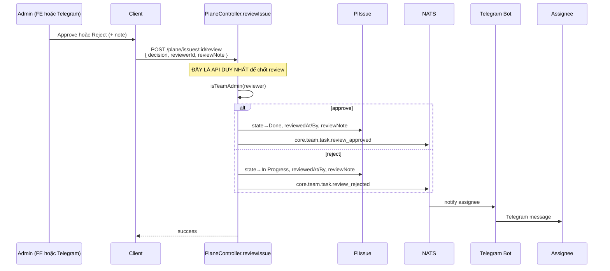
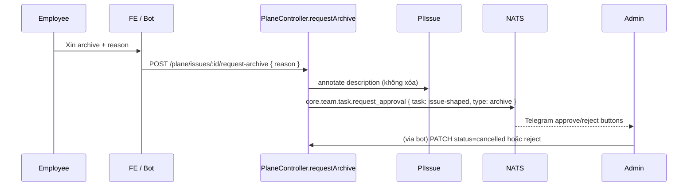

# StorymeeTeam — Unified Work Management Architecture

**Ngày:** 2026-07-17
**Trạng thái:** SSOT ecosystem (task/kanban/Plane/NATS/Telegram).
**Index Team:** [`team/README.md`](./README.md) · **App implement:** `1-Harness-Apps/StorymeeTeam/docs/SYSTEM_GUIDE.md`
**Plan việc:** [`team-roadmap.md`](./team-roadmap.md) (P0/P1 = NOW; Org/CRM = sau).

---

## A. Task Lifecycle (Sequence) — 1 SSOT

### A.1. Single Source of Truth

| Layer | Source of Truth | Cấm |
|---|---|---|
| Issue / Task / Subtask | **`pl_issues` (`PlIssue`)** | Ghi mới vào `omni_tasks` / `omni_sub_tasks` cho Kanban |
| Project | **`pl_projects` (`PlProject`)** | `omni_projects` cho UI Kanban |
| State | **`pl_states` (`PlState`)** | String status rời rạc trên SubTask |
| API prefix | **`/internal/v1/team/plane/*`** | `/hr/tasks/*` cho issue lifecycle |
| Realtime notify | **NATS `core.team.*` → Telegram + Socket** | Telegram PATCH rồi tự spam admin (bypass NATS) |

```
Frontend (StorymeeTeam)  ──┐
                           ├──► storymee-hub / dev-hub
Telegram Bot / MCP       ──┘         │
                                     ▼
                              core-team-api :4503
                                     │
                     ┌───────────────┼───────────────┐
                     ▼               ▼               ▼
               Prisma PlIssue     NATS pub      Socket.io
                     │               │               │
                     │               ▼               ▼
                     │        storymeeteam-mcp   FE useSocketState
                     │        (Telegram notify)
                     ▼
                  PostgreSQL
```

### A.2. State machine (chuẩn)

```
Backlog ──► Todo ──► In Progress ──► In Review ──► Done
                         │               │              ▲
                         │               └── reject ──► In Progress
                         │                              │
                         └── archive (self) ──► Cancelled│
                         └── hard delete (assignee|admin)
                         └── assignee may go straight to Done (no admin gate)
```

**Admin request còn lại (HR):** xin nghỉ / remote / sick / personal — **không** còn xin admin để Done/archive/xoá task.

| UI / FE status | API `status` body | PlState.name | PlState.group |
|---|---|---|---|
| Backlog | `backlog` | Backlog | backlog |
| Todo | `todo` / `pending` | Todo | unstarted |
| In Progress | `working` / `in_progress` | In Progress | started |
| In Review | `in_review` | In Review | started |
| Done | `done` / `completed` | Done | completed |
| Archive | `cancelled` | Cancelled | cancelled |

### A.2b Self-service vs admin (2026-07-17)

| Hành động | Ai | Tool / API |
|-----------|-----|------------|
| Done | Assignee (hoặc admin) | `update_issue` / `update_issue_state` — **không** ép In Review |
| Archive | Assignee hoặc admin | `archive_issue` → `PATCH status=cancelled` |
| Hard delete | Assignee hoặc admin | `delete_issue` → `DELETE /plane/issues/:id` |
| Review output (optional) | Admin only | `review_issue` → `POST .../review` |
| Xin nghỉ / remote | User → admin duyệt | `leave_request` / `submit_leave_request` |
| Check-in workType | Auto | Full remote HR **hoặc** đơn remote **approved** hôm nay → `remote` |
| Duyệt remote leave | Admin | Auto ghi attendance remote các ngày trong đơn |

### A.3. Sequence — Tạo task



**Quy tắc:** Cả FE và Bot **chỉ** gọi `POST /plane/issues`. Không gọi `/projects/tasks` (legacy OmniTask).

### A.4. Sequence — Nộp output / In Review (submit)



### A.5. Sequence — Admin duyệt / từ chối



**Cấm:** Telegram `PATCH status=done` hoặc `status=working` để “duyệt tay” — bỏ qua NATS + không ghi `reviewedAt` đúng.

### A.6. Sequence — Archive request



---

## B. Audit Gap — Code vs Docs & FE vs Telegram

### B.1. Dual-write (lỗi gốc)

| Hệ | Bảng | Ai còn ghi? | FE đọc? |
|---|---|---|---|
| **Plane (mới)** | `pl_issues` | FE Kanban, MCP planeTools, phần lớn Telegram | **Có** |
| **Legacy Omni** | `omni_tasks` + `omni_sub_tasks` | `AdminController.createTask`, `modules/tasks`, `HrTaskController`, `requestArchiveTask` | **Không** |

→ Tạo task / archive / approve qua legacy = **biến mất trên Kanban FE**.

### B.2. Ma trận lệch hành vi (trước fix)

| Hành động | Frontend | Telegram (trước) | Hệ quả bug |
|---|---|---|---|
| Tạo issue | `POST /plane/issues` | MCP `create_issue` → plane ✅; legacy form có thể ghi Omni ❌ | Task ghost |
| Update status | PATCH `{ status }` | Đôi khi chỉ `{ stateId }` | NATS `submitted_for_review` **không fire** (check `data.status`) |
| Submit output | PATCH `status=in_review` + output | Chỉ PATCH output, **không** set `in_review`; notify admin hardcode email | FE vẫn Todo/In Progress; admin list lệch |
| Review approve | `POST .../review` | `PATCH status=done` + notify tay | Không set reviewedAt qua review API; double notify; NATS review_* miss |
| Review reject | `POST .../review` | `PATCH status=working` | `working` map In Progress OK nhưng miss NATS review_rejected path chuẩn |
| Request archive | `POST /hr/tasks/:id/request-archive` (SubTask) | `request_issue_approval` **no-op** (không gọi API) | 404 FE; bot fake success |
| Admin detect | Hardcode 3 emails | Hardcode 3 emails **và** NATS filter `role==='admin'` | Founder/IT Admin không nhận leave/task notify |
| Identity Telegram | — | username; callback không match chatId | User đổi username → mất quyền |

### B.3. Status vocabulary drift

| Client | Done | In Progress | In Review |
|---|---|---|---|
| FE mapIssueStatus | group completed | working / In Progress | in review |
| FE handleUpdateTask | `done` | `working` | `in_review` |
| Telegram update_issue_state | state name Done | state name | redirect In Review via stateId only |
| PlaneController map | done/completed | working/in_progress | in_review / in review |
| review reject body (TG) | — | `working` | — |

### B.4. NATS subjects (chuẩn sau unify)

| Subject | Publisher | Consumer |
|---|---|---|
| `core.team.issue.updated` | PlaneController | core-team Socket → FE |
| `core.team.issue.created` | PlaneController | Bot (optional) |
| `core.team.issue.deleted` | PlaneController | FE/Bot |
| `core.team.task.submitted_for_review` | PlaneController | Bot → Admin |
| `core.team.task.review_approved` | PlaneController.reviewIssue | Bot → Assignee |
| `core.team.task.review_rejected` | PlaneController.reviewIssue | Bot → Assignee |
| `core.team.task.request_approval` | Plane request-archive | Bot → Admin |
| `core.team.leave.*` | HrController | Bot |

### B.5. Admin authorization (chuẩn)

`isTeamAdmin(member)` = true nếu:

1. `email` ∈ `TEAM_ADMIN_EMAILS` (env, default 3 emails hiện tại), **hoặc**
2. `role` chứa chứa (case-insensitive): `Founder`, `IT Admin`, `admin`, `director`, `boss`, `manager`, `hr`

Dùng chung: FE (optional), Plane review, Telegram callbacks, NATS admin fan-out.

---

## C. Refactor Plan — Unify + Feature structure

### C.1. Nguyên tắc cứng (contract)

1. **Mọi mutation task** đi qua `/internal/v1/team/plane/*`.
2. **Submit review** luôn `status: "in_review"` (+ output fields). Backend tự resolve PlState + NATS.
3. **Approve/Reject** chỉ `POST /plane/issues/:id/review`.
4. **Không dual-notify:** Client không tự `sendMessage` admin sau submit nếu đã dựa NATS (fallback chỉ khi API lỗi).
5. Legacy `Task`/`SubTask`/`omni_projects`: freeze write path Kanban; chỉ giữ HR-adjacent nếu còn dependency.

### C.2. Backend (`core-team-api`)

- [x] `teamAuth.service` — `isTeamAdmin`
- [x] PlaneController: detect In Review từ **final state**, không chỉ `data.status`
- [x] PlaneController: persist `reviewNote` / `reviewedById` / `reviewedAt` khi có trên PATCH (compat)
- [x] `POST /plane/issues/:id/request-archive` trên PlIssue + NATS
- [x] `reviewIssue` dùng `isTeamAdmin`
- [x] Publish admins list bằng `isTeamAdmin` + telegramChatId

### C.3. Telegram (`storymeeteam-mcp`)

- [x] Submit/finalize: luôn PATCH `status: 'in_review'`
- [x] Approve/Reject: `POST .../review` (không PATCH done/working)
- [x] `update_issue_state` redirect In Review: gửi `status: 'in_review'`
- [x] `request_issue_approval`: gọi API thật
- [x] NATS admin filter: `isTeamAdmin`-compatible (email + role keywords)

### C.4. Frontend (`StorymeeTeam`)

- [x] Archive request → `/plane/issues/:id/request-archive`
- [x] Shared status constants (optional thin module)
- [ ] Feature `index.ts` public API (incremental, non-blocking)

### C.5. Legacy freeze (done 2026-07-17)

| Route | Status |
|---|---|
| `POST /omnitask/` (`AdminController.createTask`) | **410 LEGACY_TASK_CREATE_FROZEN** |
| `POST /projects/tasks` | **410** |
| `POST /hr/subtasks` | **410 LEGACY_SUBTASK_CREATE_FROZEN** |
| `POST /hr/tasks/:id/request-archive` | **410** |
| `POST /omnitask/hr/tasks/:id/request\|approve` | **410** |

Smoke: `node 2-MCP-Core/core-team-api/scripts/smoke_issue_lifecycle.js`

### C.6. Không làm trong pass này

- Migrate historical rows `omni_sub_tasks` → `pl_issues` (cần script riêng)
- Xóa hẳn legacy tables (chỉ freeze write)
- GraphQL / Plane.so cloud sync đầy đủ
- Soft-link TeamMember.email → users.id (xem `team-hr-vs-account.md`)

---

## D. Checklist verify sau deploy

1. FE: tạo task → hiện Kanban; Telegram `/cong_viec` thấy cùng shortId.
2. Telegram: nhân sự mark Done → In Review + admin nhận 1 notify (NATS).
3. FE: submit output → admin Telegram nhận cùng event.
4. Admin Telegram Approve → FE poll/socket thấy Done; assignee nhận notify.
5. Admin FE Reject → Telegram assignee nhận note; state In Progress.
6. FE request archive (PlIssue id) → không 404; admin nhận approve buttons.
7. Leave request → admin có role Founder vẫn nhận (không chỉ role==='admin').
